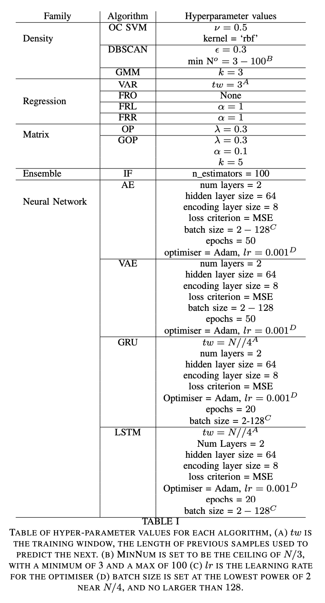

# Outlier Data Detection Systems - ODDS

# As used in paper "Simple Models are Effective in Anomaly Detection in Multi-variate Time Series"

> pip install odds

The work is done by the **OD** object. Import the 'OD' object as follows:

> from odds import OD

Instantiate the object with the 'algo' argument, where a short string represents the algorithm you wish to use. In this case, 'VAR' refers to vector autoregression, a simple linear multidimensional regression algorithm. Other implemented algorithms are listed below.

> od = OD('VAR')

To use the object, you need to call the 'get_os()' function, with 'X' as its argument, where X is a data matrix, **n** samples by **p** features. **p must be 2 or greater to work**
on many of the systems, this returns a vector with n scores, one for each sample.

> outlier_scores = od.get_os(X)

The higher scores are the more outlying. you can then set a threshold if you wish, or just look at the ranking. Scores have not been sanitised, they may contain 'nan' values particularly from the 'VAE' if the data input has not been scaled. However it seems other algorithms work better without scaling, so inputs are not automatically scaled.

Hyperparameters for each of these algorithms are currently fixed to the values in my paper, however at some point I will be finishing implementing a pass though allowing you to specify the hyperparameters at instantiation. This is on my ToDo list.

To get normalised (between 0 and 1) scores, use the 'norm' keyword argument. This may result in errors if the data is not normalised, as there may be infinite values in the scores (usually only from the 'VAE').

> normalised_scores = od.get_os(X, norm=True)

Valid strings for outlier algorithms:

- 'VAR' Vector Autoregression
- 'FRO' Ordinary Feature Regression
- 'FRL' LASSO Feature Regression
- 'FRR' Ridge Feature Regression
- 'GMM' Gaussian Mixture model
- 'IF' Isolation Forest
- 'DBSCAN' Density Based Spatial Clustering and Noise
- 'OCSVM' One Class Support Vector Machine
- 'LSTM' Long Short Term Memory
- 'GRU' Gated Recurrent Unit
- 'AE' Autoencoder
- 'VAE' Variational Autoencoder
- 'OP' Outlier Pursuit
- 'GOP' Graph Regularised Outlier Pursuit
- 'RAND' Random scoring (for baseline comparison)

Hyperparameter table 
